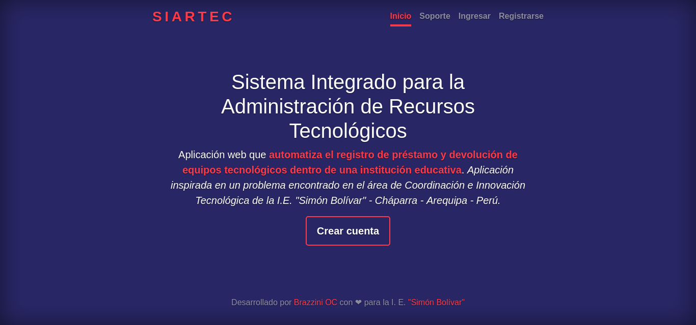
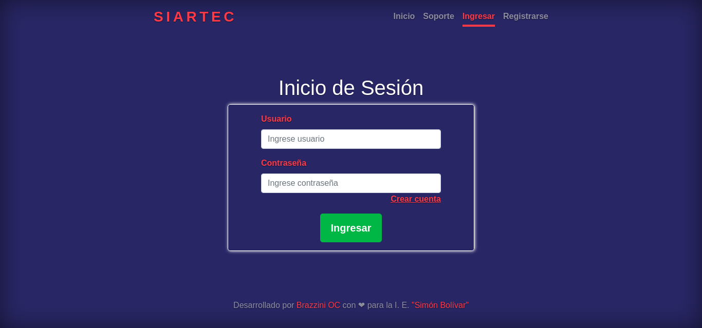
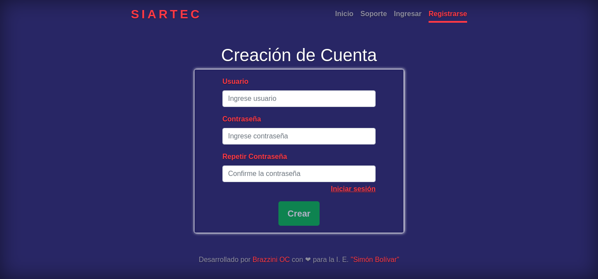
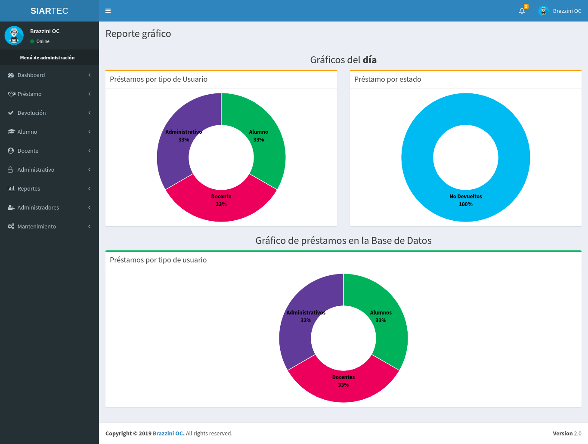

# SIARTEC
**Sistema Integrado para la Administración de Recursos Tecnológicos.**  
Aplicación web que automatiza el registro de préstamo y devolución de equipos tecnológicos dentro de una institución educativa. Aplicación inspirada en un problema encontrado en el área de Coordinación e Innovación Tecnológica de la I.E. "Simón Bolívar" - Cháparra - Arequipa - Perú.

## Screenshots  

### Home  

### Soporte  

### Ingresar  

### Registrarse  

### Módulo de Reporte gráfico  

